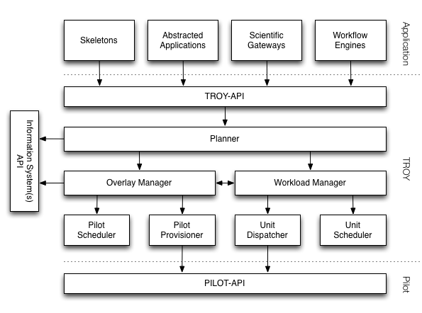

.. _chapter_introduction:

********************************************************************************
Introduction
********************************************************************************

RADICAL-OWMS (Tiered Resource OverlaY) is a Workload Management System (WMS) [#f1]_ [#f2]_ [#f3]_ [#f4]_ that leverages and Overlay Management System (OMS) [#f5]_ [#f6]_ to create its resource layers. As a WMS, RADICAL-OWMS translates tasks into Compute Units (CUs) and in a near future also into Data Units (DUs). As a OMS, RADICAL-OWMS describes and submits pilotjobs on Distributed Computing Infrastructures (DCIs) - FutureGrid, XSEDE, and in a near future also OSG. Once the scheduled pilot job(s) become available on one or more DCIs, RADICAL-OWMS schedules the CUs (and DUs) of a workload on those pilots for execution. RADICAL-OWMS takes also care of staging data in and out of the DCI before and after the execution of the tasks of the workload(s).

Why RADICAL-OWMS
========================================

RADICAL-OWMS offers:

* **Convenience**. Automation of several activities required by the execution of workloads by means of pilotjobs. Such activities are: (I) the management - descripiton, scheduling, monitoring, and cancelling - of pilot-based overlays; and (II) the management - i.e. description, binding, execution on one or more pilotjobs, and data staging in/out - of Comput Units (CUs). Automating such activities becomes particularly critical when considering scaling for both the workload - number of tasks, complexity of the relationship among them - and overlay - multiple pilotjobs, running on multiple resources or multiple DCIs. 
* **Functionalities**. Execution of a workload by means of multiple strategies, allowing control over: number of workloads, data staging in/out, number of pilots to use, degree of concurrency of a bag of tasks, number of targeted resources, cross-domain DCIs, type of scheduling algorithms for both CUs and pilotjobs, type of pilot system to use.
* **Performance**. Fine tuning of the workload execution depending on the number of tasks and the number of pilots so to optimize the workload execution. Programmatic early binding on CUs to pilots in order to optimize pilot allocation and utilization, especially when executing ensambles and other types of 'multi-staged' workloads. In a near future, leveraging of information from the resource layer - i.e. DCIs - in order to reduce queuing time.

Architecture
========================================

RADICAL-OWMS is modular and plugin based. Modular because each type of functionality is isolated into a dedicated module - i.e. a box in the architecture diagram; plugin based because for each module, different algorithms that implement the desired functionality are coded into a plugin. So, for example, scheduling CUs over an overlay is a functionality ecampsualted into a dedicated module - the Unit Scheduler - and implemented by means of plugins, one for each scheduling algorightm. 

* **Planner**. The user-facing module of RADICAL-OWMS, the planner takes care of recieving the workload, and creating two objects to pass respectively to the Workload and the Overlay Manager. In the future, the planner will be able to evaulaute alternative execution strategies of workloads with arbitrary complex relationships among their tasks while polling information about the state of the available DCIs. 
* **Workload Manager**. Takes care of translating the workload passed by the Planner into a set of Compute Units (CUs). This translation is based on the intrinsic characteristics of the given workload and, if any, on the current state of the resource overlays. Currently, each task of the workload is translated into a CU but in the future, this translation could become *N:N*. 
* **Unit Scheduler**. Recieves a set of units and an overlay as input and returns a mapping of units over the pilot(s) composing the overlay as output. Different scheduling algorithms may be used, *round robin* and *load balancing* being the one currently available.
* **Unit Dispatcher**. It intefaces with a pilot system  and takes care of distributing the units over one or more pilots by following the mapping produced by the Unit Shceduler. Currently, two pilot systems are supported: RADICAL-Pilot and BigJob.
* **Overlay Manager**. Takes care of describing and managing the overlays necessary to execute one or more workloads. Typical properties used to describe the pilot(s) composing an overlay are: number of cores, duration, and location. Location - where the pilot(s) will be scheduled and then run - can be decided statically when one or more resource endpoints are provided by the user, or dynamically when the state of the DCI(s) is polled in order to derive load, queue length, availability, and so on. Dynamic decisions are currently not implemented and in the future other types of containers could be used alongside pilots like, for example, virtual machines.
* **Pilot Scheduler**. Takes a set of pilots and a set of resources as input and returns a mapping of each pilot over each resource, depending on the chosen scheduling algorithm. *Round Robin* is currently the only scheduling plugin implemented for remote resources. A *local* plugin is available to run the workload on a local machine for testing purposes.
* **Pilot Provisioner**. It interfaces with a pilot system to schedule a set of pilots over a set of resources by following the mapping produced by the Pilot Scheduler. Currently, two pilot systems are supported: RADICAL-Pilot and BigJob.

.. rubric:: Footnotes

.. [#f1] gLite (http://indico.cern.ch/event/3580/session/26/contribution/190/material/paper/0.pdf).
.. [#f2] GlideinWMS (http://www.uscms.org/SoftwareComputing/Grid/WMS/glideinWMS/doc.prd/index.html).
.. [#f3] DIRAC Workload Management System (http://indico.cern.ch/event/0/session/23/contribution/365/material/paper/0.pdf).
.. [#f4] PANDA (http://ieeexplore.ieee.org/xpls/abs_all.jsp?arnumber=6496085&tag=1).
.. [#f5] BigJob (http://saga-project.github.io/BigJob/).
.. [#f6] RADICAL-Pilot (http://radical-pilot.readthedocs.org/en/latest/). 
